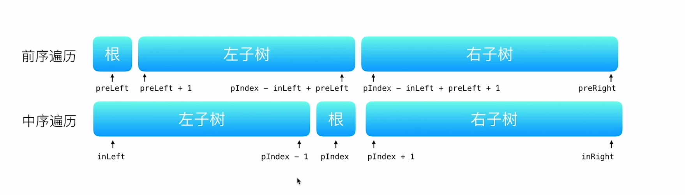

#### 105. Construct Binary Tree from Preorder and Inorder Traversal(从前序与中序遍历序列构造二叉树)
##### 题目描述

根据一棵树的前序遍历与中序遍历构造二叉树。

**注意:**
你可以假设树中没有重复的元素。

例如，给出
 
```
前序遍历 preorder = [3,9,20,15,7]
中序遍历 inorder = [9,3,15,20,7]

```
返回如下的二叉树：

```
    3
   / \
  9  20
    /  \
   15   7

```

##### 递归
对于任何一个树来说，前序遍历的形式总是
```
[根节点, [左子树的前序遍历结果], [右子树的前序遍历结果] ]
```
而中序遍历的形势是

```
[ [左子树的中序遍历结果], 根节点, [右子树的中序遍历结果] ]
```
所以有前序和中序遍历结果，我们可以得到前序遍历的第一个节点一定是根节点，然后在中序遍历中由根节点我们可以划分出左子树还有右子树，然后根据中序遍历所划分的左子树，根节点，右子树，我们可以在前序遍历中划分相应区间的index,然后递归的生成根节点，左子树的所有节点，右子树的所有节点。

**注意**我们每次需要根据前序遍历的第一个节点(也就是根节点,用Map存储inorder的全部节点值和index)，来找到该节点在中序遍历的位置，并划分区域。如下图  




##### 代码

```Java
class Solution {
  public TreeNode buildTree(int[] preorder, int[] inorder) {
    int preLen = preorder.length;
    int inLen = inorder.length;
    
    //存储inorder的值和index进Map，为了根据前序遍历的第一位(根节点)来找到根节点在inorder的位置
    Map<Integer, Integer> map = new HashMap<>();
    for(int i = 0; i < inorder.length; i++) {
      map.put(inorder[i], i);
    }
    
    return buildTree(preorder, 0, preLen - 1, map, 0, inLen - 1);
  }
  private TreeNode buildTree(int[] preorder, int preLeft, int preRight, Map<Integer, Integer> map, int inLeft, int inRight) {
    if(preLeft > preRight || inLeft > inRight) return null;
    
    //找到根节点在中序遍历的index
    int pIndex = map.get(preorder[preLeft]);
    
    TreeNode root = new TreeNode(preorder[preLeft]);
    
    //递归生成根节点的左子树所有节点
    root.left = buildTree(preorder, preLeft + 1, pIndex - inLeft + preLeft, map, inLeft, pIndex - 1);
    //递归生成根节点的左右子树所有节点
    root.right = buildTree(preorder, pIndex - inLeft + preLeft + 1, preRight, map, pIndex + 1, inRight);
    return root;
  }
}
```

##### 复杂度分析
* 时间复杂度：O(n) n为每个节点都需要访问一次
* 空间复杂度：O(n) 我们需要用Map存储inorder数据并进行查找

