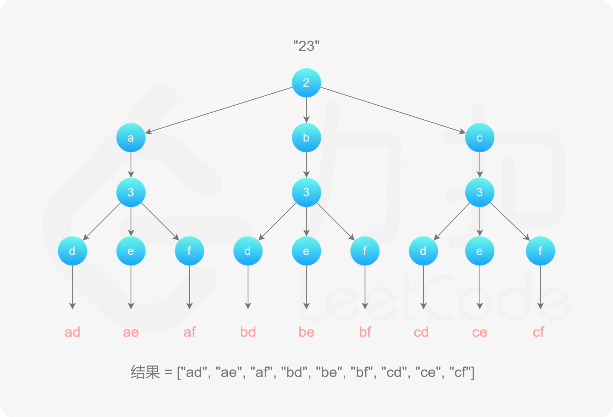

#### 17.Letter Combinations of a Phone Number(电话号码的字母组合)
##### 题目描述
给定一个仅包含数字 2-9 的字符串，返回所有它能表示的字母组合。

给出数字到字母的映射如下（与电话按键相同）。注意 1 不对应任何字母。

  
示例: 
```
输入："23"
输出：["ad", "ae", "af", "bd", "be", "bf", "cd", "ce", "cf"]
```

##### 算法思路
因为是排列组合问题，所以我们可以画出本题的树形结构图。

从树形结构图中我们可以看出相应的规律,使用回溯算法是解决此类问题的最佳方法

```Java
class Solution {
  //定义键盘数字映射表
    private static final String[] map = { "", "", "abc", "def", "ghi", "jkl", "mno", "pqrs", "tuv", "wxyz" };
    public static List<String> letterCombinations(String digits) {
        List<String> res = new ArrayList<>();
        if(digits.length() == 0) return res;
        StringBuilder sb = new StringBuilder();

        dfs(digits, 0, sb, res);
        return res;
    }

    private static void dfs(String digits, int index, StringBuilder sb, List<String> res) {
        //递归的终止条件,如果已经遍历完digits对应的字符的最后一层，就说明已经生成了和digits.length()相等的一个组合
        if(digits.length() == index) {
            res.add(sb.toString());
            return;
        }
        //从map映射中找到当前层(index)对应的字符
        String letters = map[digits.charAt(index) - '0'];

        //循环该层所有字符例如2->"abc"
        for(int i = 0; i < letters.length(); i++) {
            //得到letters得每一个字符->letters[i]
            char c = letters.charAt(i);
            //把该字符添加到StringBuilder中
            sb.append(c);
            //上面sb中已经添加了一个数，需要进入到下一层，也就是进入到3对应的“def”中找到下一个字符
            dfs(digits, index + 1, sb, res);
            //每生成一轮完整的组合，都需要删除一个字符，一遍下次在生成当前层别的字符
            sb.deleteCharAt(sb.length() - 1);
        }
    }
}
```

* 时间复杂度: O(4^n),n为给定的digits的长度
* 空间复杂度: O(n)