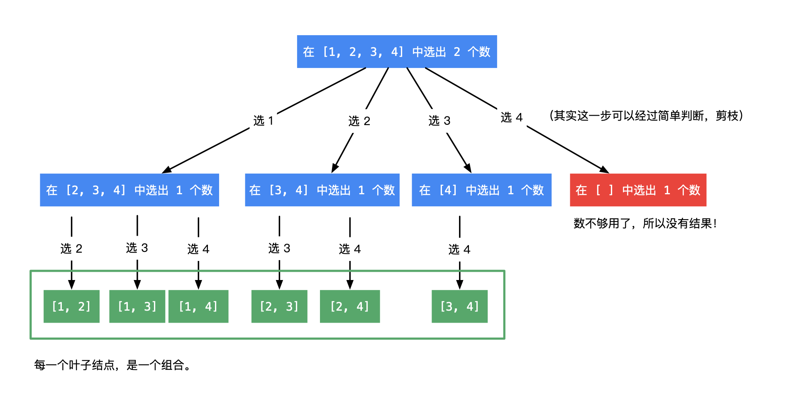

#### 77. Combinations(组合）
##### 给定两个整数 n 和 k，返回 1 ... n 中所有可能的 k 个数的组合。

示例： 
```
输入: n = 4, k = 2
输出:
[
  [2,4],
  [3,4],
  [2,3],
  [1,2],
  [1,3],
  [1,4],
]
```

##### 回溯
* 因为问题又多个步骤，每一个步骤有多个结果,所以使用回溯算法  
* 回溯算法是一棵树上的的 **深度优先遍历**
* 回溯算法首先需要画出递归树，不同的树决定了不同的代码实现
我们根据输入的n, k先画出对应的树形结构图


* 求解Combination(n,k),我们需要一个表示路径的变量cur来存储已经找到的组合，
* 每一次递归搜索需要从不同的起点开始搜索，所以需要一个start变量，区间[start, n]

此类问题，画出树形图非常重要

```Java
class Solution {
  public List<List<Integer>> combine(int n, int k) {
    List<List<Integer>> res = new ArrayList();
    List<Integer> path = new ArrayList<>();
    dfs(n, k, 1, path, res);
    return res;
  }
  public void dfs(int n, int k, int start, List<Integer> cur, List<List<Integer>> res) {
    //当每一轮生成的组合的个数等于k时，把它加进结果中
    if(cur.size() == k) {
      res.add(new ArrayList(cur));
      //结束当前一层返回上一层
      return;
    }
    //遍历可能搜索的起点
    for(int i = start; i <= n; i++) {
      //给当前组合添加数字
      cur.add(i);
      //下一轮搜索，起点要加1，因为组合不允许出现重复数字
      dfs(n, k, i + 1, cur, res);
      //深度优先遍历有回头的过程，我们之前添加了一个数，回头时需要删除一个数
      cur.remove(cur.size() - 1);
    }
  }
}

```


